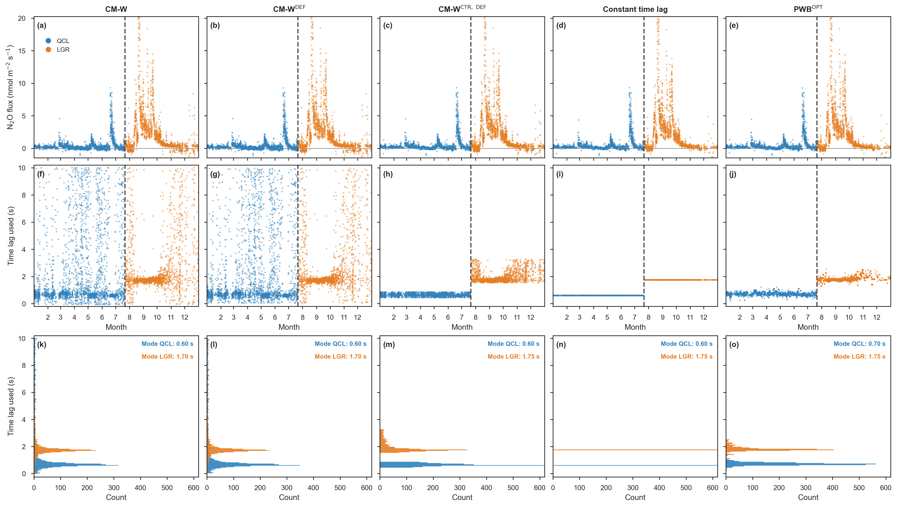
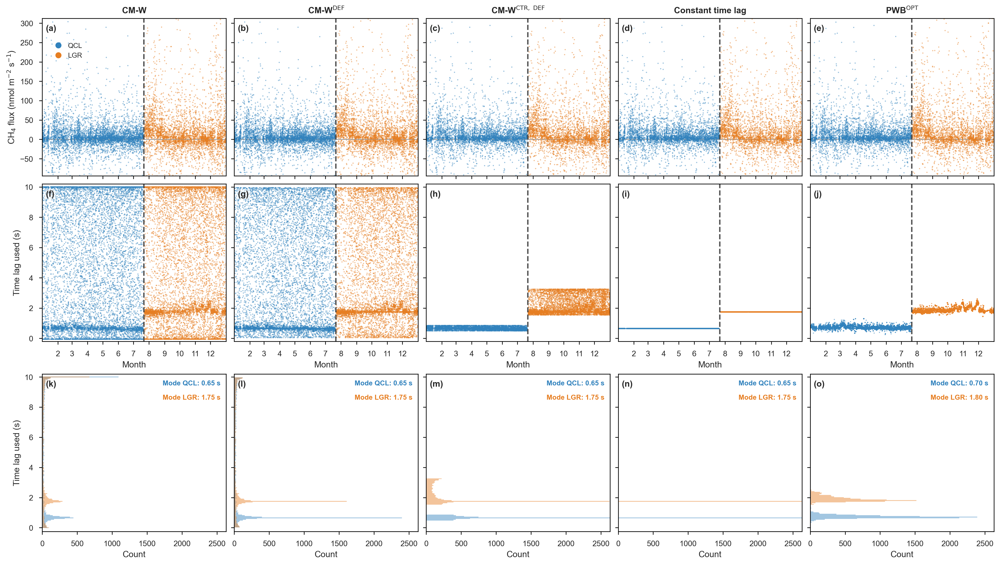
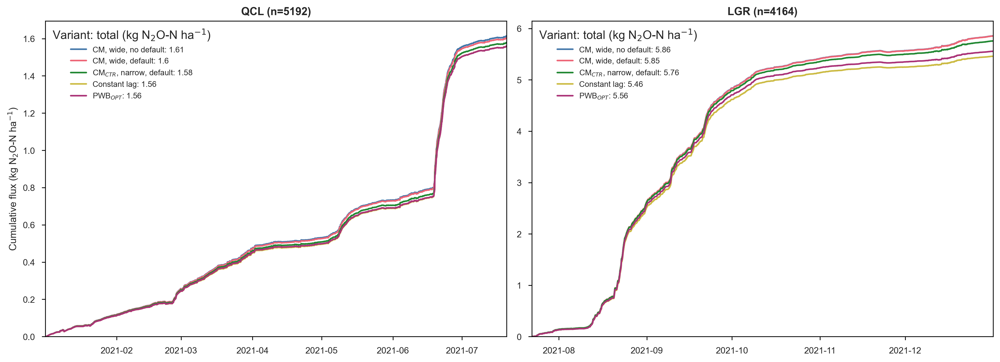
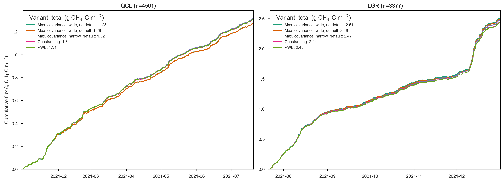

# Figure gallery

The manuscript record of the plots produced by the analysis notebooks. All
figures are built on the **quality-controlled** fluxes from the flux processing
chain ([notebook 05](../notebooks/05_flux_processing_chain.ipynb), L2 to L3.3 with
USTAR filtering) applied to every variant, shown here for the `CUT_50` USTAR
scenario. Click any figure to open it full size.

## Merged full-year flux and time lag (notebook 08)

The QCL and LGR halves of each variant stitched into one continuous 2021 series
([notebook 08](../notebooks/08_merged_analyzers_full_year.ipynb)), one figure per
gas. Each shows the merged quality-controlled flux, the time lag used, and a
per-instrument lag histogram (0.05 s bins on the EddyPro tlag raster, the two
instruments overlaid), with the five variants as columns; the dashed line marks
the QCL to LGR handover in July, and each panel prints the two instruments' modal
lags in its corner. Shown for the `CUT_50` USTAR scenario.

::::{grid} 1 1 2 2

:::{card}

+++
Merged QCL + LGR, full-year 2021 N₂O QC flux, time lag, and lag histogram by
variant (CUT_50).
:::

:::{card}

+++
Merged QCL + LGR, full-year 2021 CH₄ QC flux, time lag, and lag histogram by
variant (CUT_50).
:::

::::

## Cumulative flux comparison (notebook 09)

Cumulative quality-controlled flux (the running budget) per variant, on the
half-hours where every variant has a valid flux, integrated to a cumulative mass
(N₂O as kg N₂O-N ha⁻¹, CH₄ as g CH₄-C m⁻²). One figure per gas, with the QCL
campaign (2021_1) on the left and the LGR campaign (2021_2) on the right; each
variant's overall total is given in the legend. Lines that fan apart mean the lag
setting accumulates into a different total budget even after quality control.

::::{grid} 1 1 2 2

:::{card}

+++
N₂O cumulative QC flux by variant (kg N₂O-N ha⁻¹), QCL and LGR (CUT_50).
:::

:::{card}

+++
CH₄ cumulative QC flux by variant (g CH₄-C m⁻²), QCL and LGR (CUT_50).
:::

::::
