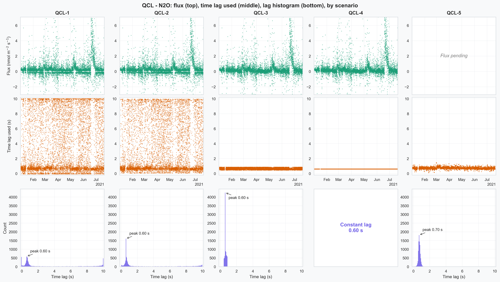
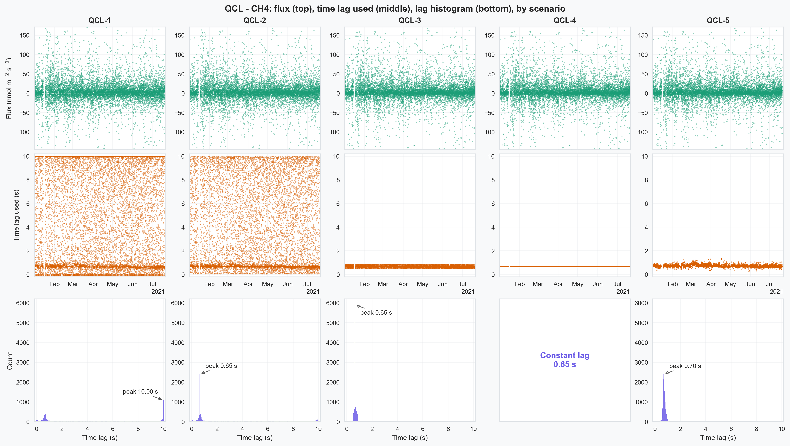
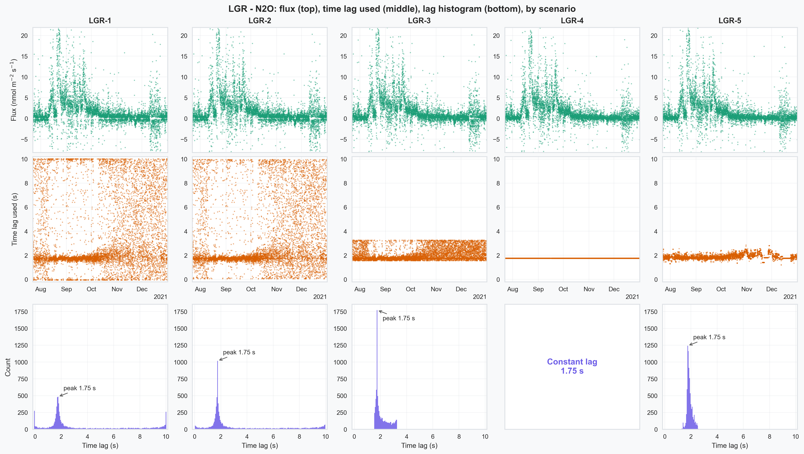
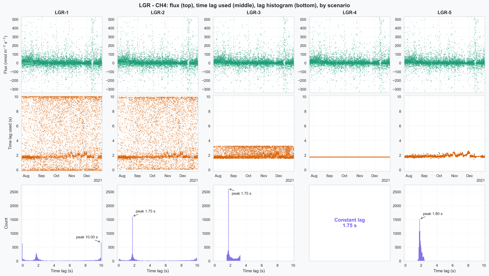
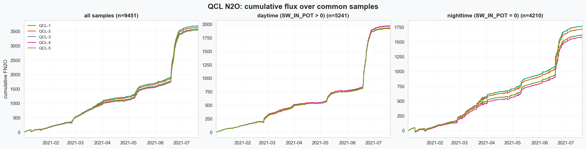
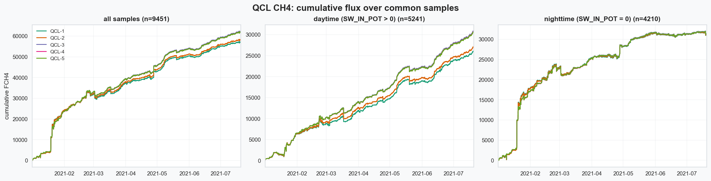
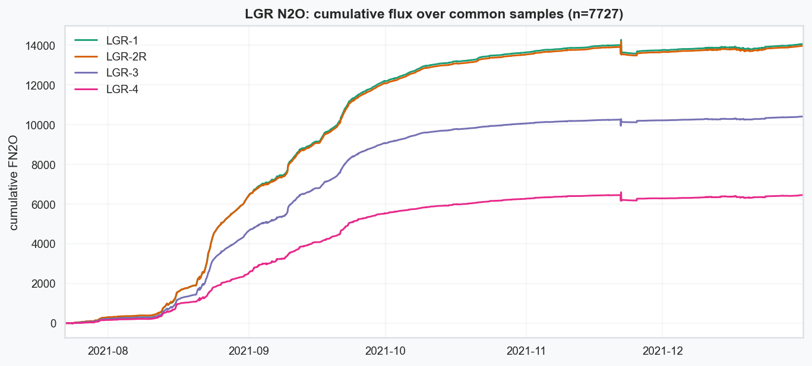
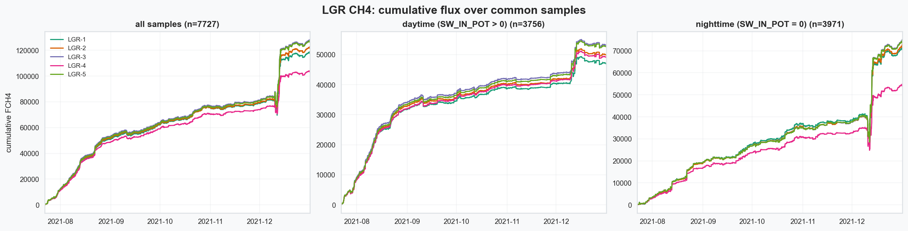

# Figure gallery

All exported figures in `figures/`, the manuscript record of the plots produced
by the analysis notebooks. Click any figure to open it full size.

## Flux and time lag by scenario (notebook 03)

Flux, time lag used, and a lag histogram per analyzer and gas, with the five
scenarios as columns. The PWB column (`*-5`) shows its flux alongside the
detected lag that shaped it (its `*_TLAG_USED` columns carry no compensation,
since the lag was removed from the raw data before flux processing).

::::{grid} 1 1 2 2

:::{card}

+++
QCL (campaign 2021_1), N₂O flux vs. time lag used.
:::

:::{card}

+++
QCL (campaign 2021_1), CH₄ flux vs. time lag used.
:::

:::{card}

+++
LGR (campaign 2021_2), N₂O flux vs. time lag used.
:::

:::{card}

+++
LGR (campaign 2021_2), CH₄ flux vs. time lag used.
:::

::::

## Cumulative flux comparison (notebook 04)

Cumulative flux (the running budget) per scenario, on the half-hours where every
scenario has a valid flux. Each figure has three panels: all common half-hours,
daytime (`SW_IN_POT > 0`), and nighttime (`SW_IN_POT == 0`). Lines that fan apart
mean the lag setting accumulates into a different total budget.

::::{grid} 1 1 2 2

:::{card}

+++
QCL, N₂O cumulative flux by scenario (all / daytime / nighttime).
:::

:::{card}

+++
QCL, CH₄ cumulative flux by scenario (all / daytime / nighttime).
:::

:::{card}

+++
LGR, N₂O cumulative flux by scenario (all / daytime / nighttime).
:::

:::{card}

+++
LGR, CH₄ cumulative flux by scenario (all / daytime / nighttime).
:::

::::
