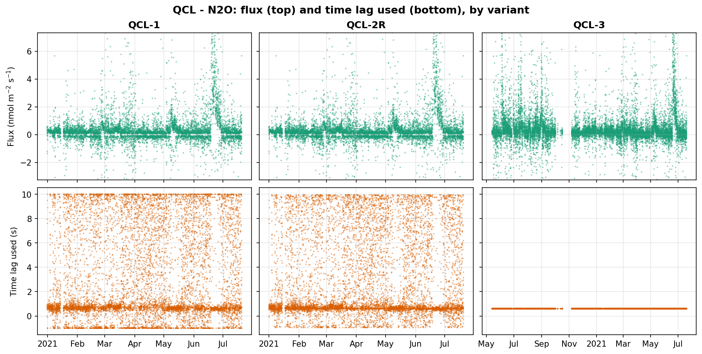
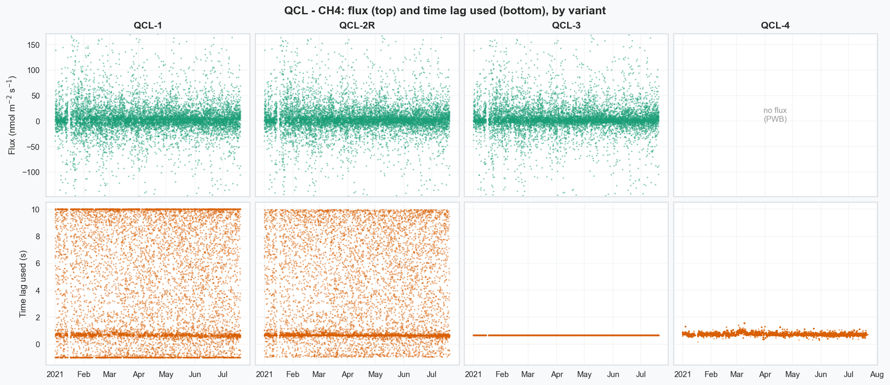
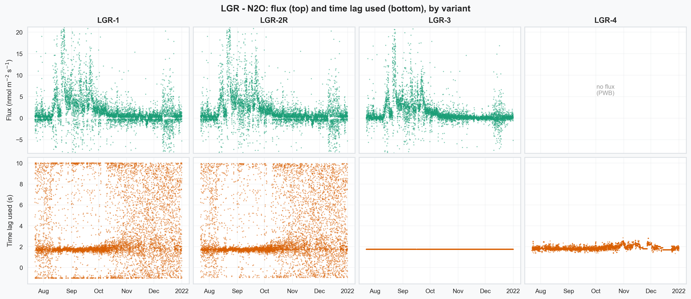
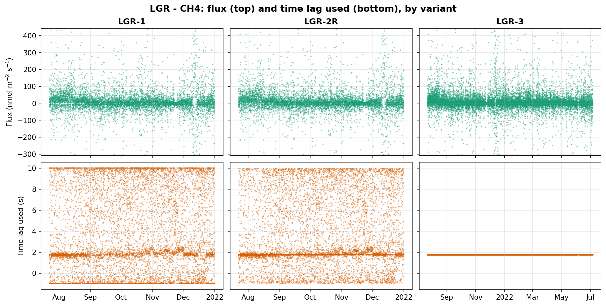

# Figure gallery

All exported figures in `figures/`, the manuscript record of the plots produced
by the analysis notebooks. Click any figure to open it full size.

::::{grid} 1 1 2 2

:::{card}

+++
QCL (campaign 2021_1), N₂O flux vs. time lag used.
:::

:::{card}

+++
QCL (campaign 2021_1), CH₄ flux vs. time lag used.
:::

:::{card}

+++
LGR (campaign 2021_2), N₂O flux vs. time lag used.
:::

:::{card}

+++
LGR (campaign 2021_2), CH₄ flux vs. time lag used.
:::

::::
