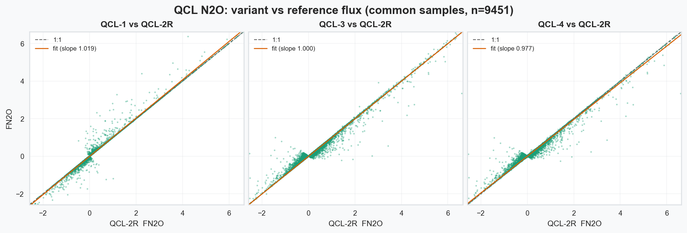
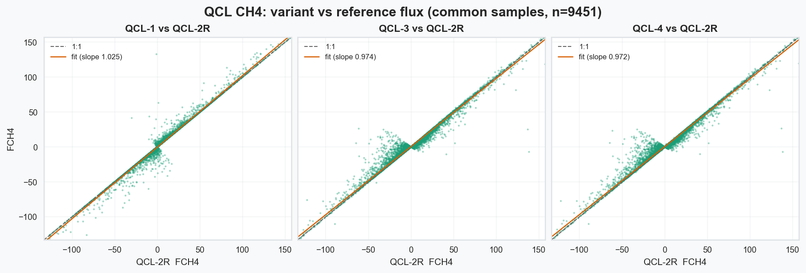
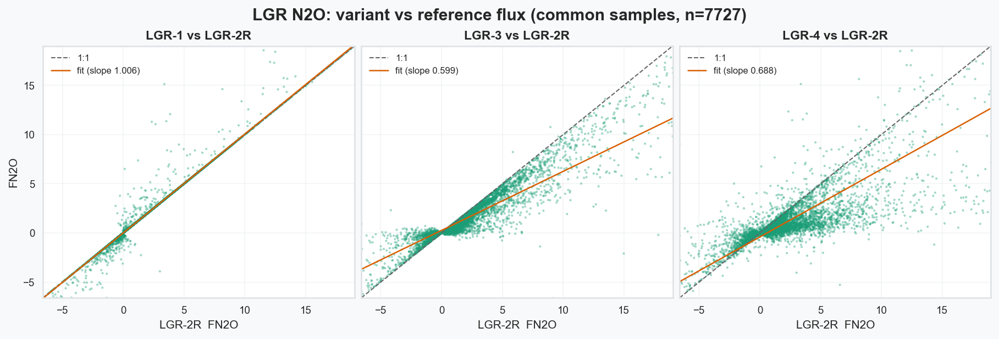
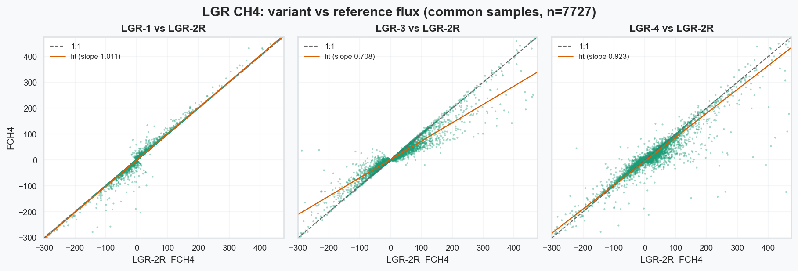

# Figure gallery

All exported figures in `figures/`, the manuscript record of the plots produced
by the analysis notebooks. Click any figure to open it full size.

## Flux and time lag by variant (notebook 03)

Flux, time lag used, and a lag histogram per analyzer and gas, with the four
lag variants as columns.

::::{grid} 1 1 2 2

:::{card}

+++
QCL (campaign 2021_1), N₂O flux vs. time lag used.
:::

:::{card}

+++
QCL (campaign 2021_1), CH₄ flux vs. time lag used.
:::

:::{card}

+++
LGR (campaign 2021_2), N₂O flux vs. time lag used.
:::

:::{card}

+++
LGR (campaign 2021_2), CH₄ flux vs. time lag used.
:::

::::

## Variant flux comparison (notebook 04)

Comparison of the four variants on the half-hours where all four have a valid
flux. The cumulative plots show how the lag setting shifts the overall flux; the
regression plots show each variant against the reference (`*-2R`).

::::{grid} 1 1 2 2

:::{card}

+++
QCL, N₂O cumulative flux by variant.
:::

:::{card}

+++
QCL, CH₄ cumulative flux by variant.
:::

:::{card}

+++
LGR, N₂O cumulative flux by variant.
:::

:::{card}

+++
LGR, CH₄ cumulative flux by variant.
:::

:::{card}

+++
QCL, N₂O variant vs. reference flux.
:::

:::{card}

+++
QCL, CH₄ variant vs. reference flux.
:::

:::{card}

+++
LGR, N₂O variant vs. reference flux.
:::

:::{card}

+++
LGR, CH₄ variant vs. reference flux.
:::

::::
