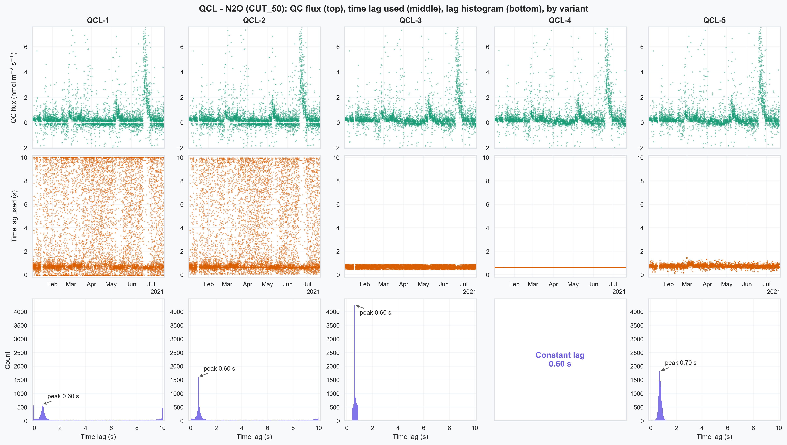
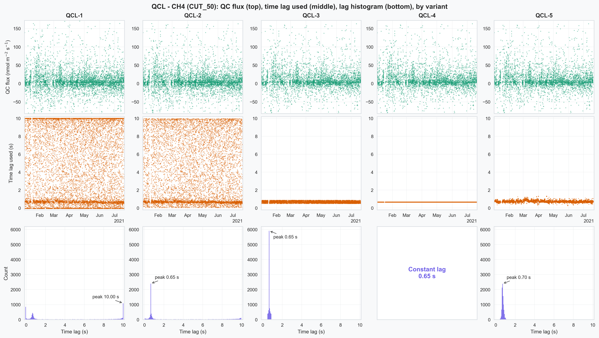
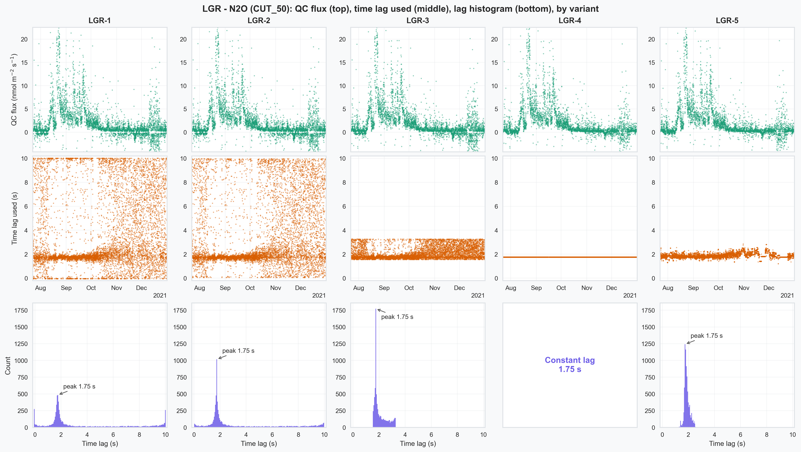
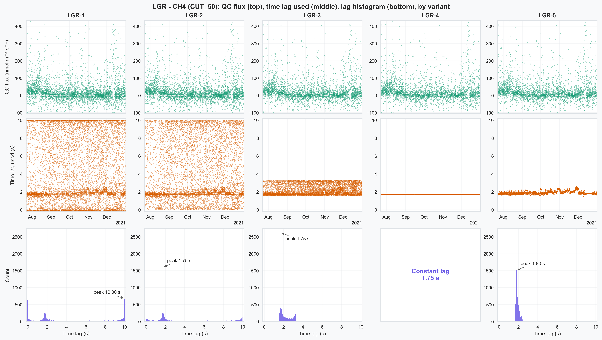
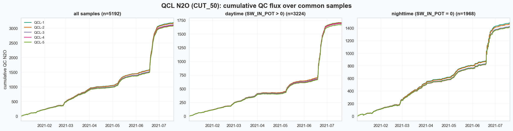
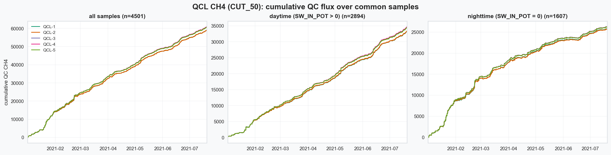
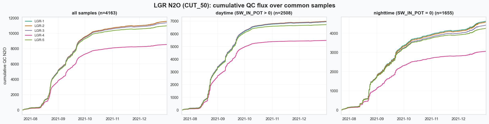
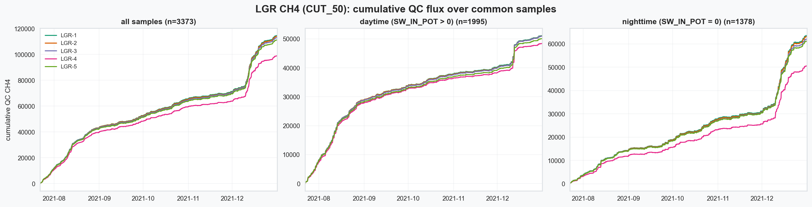

# Figure gallery

The manuscript record of the plots produced by the analysis notebooks. The
relevant figures are built on the **quality-controlled** fluxes
([notebook 06](../notebooks/06_figures_qc_fluxes.ipynb)): the flux processing
chain (L2 to L3.3, USTAR filtering) applied to every variant, shown here for the
`CUT_50` USTAR scenario. The earlier raw-flux plots from notebooks 03 and 04 are
intermediate versions, superseded by these; they remain available in the
[Repository inventory](../notebooks/00_inventory.ipynb). Click any figure to open
it full size.

## Flux and time lag by variant (notebook 06)

Quality-controlled flux, time lag used, and a lag histogram per analyzer and gas,
with the five variants as columns. The PWB column (`*-5`) shows its flux alongside
the detected lag that shaped it (its `*_TLAG_USED` columns carry no compensation,
since the lag was removed from the raw data before flux processing).

::::{grid} 1 1 2 2

:::{card}

+++
QCL (campaign 2021_1), N₂O QC flux vs. time lag used (CUT_50).
:::

:::{card}

+++
QCL (campaign 2021_1), CH₄ QC flux vs. time lag used (CUT_50).
:::

:::{card}

+++
LGR (campaign 2021_2), N₂O QC flux vs. time lag used (CUT_50).
:::

:::{card}

+++
LGR (campaign 2021_2), CH₄ QC flux vs. time lag used (CUT_50).
:::

::::

## Cumulative flux comparison (notebook 06)

Cumulative quality-controlled flux (the running budget) per variant, on the
half-hours where every variant has a valid flux. Each figure has three panels: all
common half-hours, daytime (`SW_IN_POT > 0`), and nighttime (`SW_IN_POT == 0`).
Lines that fan apart mean the lag setting accumulates into a different total
budget even after quality control.

::::{grid} 1 1 2 2

:::{card}

+++
QCL, N₂O cumulative QC flux by variant (all / daytime / nighttime, CUT_50).
:::

:::{card}

+++
QCL, CH₄ cumulative QC flux by variant (all / daytime / nighttime, CUT_50).
:::

:::{card}

+++
LGR, N₂O cumulative QC flux by variant (all / daytime / nighttime, CUT_50).
:::

:::{card}

+++
LGR, CH₄ cumulative QC flux by variant (all / daytime / nighttime, CUT_50).
:::

::::

## Merged full-year flux and time lag (notebook 08)

The QCL and LGR halves of each variant stitched into one continuous 2021 series
([notebook 08](../notebooks/08_merged_analyzers_full_year.ipynb)), one figure per
gas. Each shows the merged quality-controlled flux, the time lag used, and a
stacked per-instrument lag histogram, with the five variants as columns; the
dashed line marks the QCL to LGR handover in July, and the histogram peaks label
each instrument's modal lag. Shown for the `CUT_50` USTAR scenario.

::::{grid} 1 1 2 2

:::{card}

+++
Merged QCL + LGR, full-year 2021 N₂O QC flux, time lag, and lag histogram by
variant (CUT_50).
:::

:::{card}

+++
Merged QCL + LGR, full-year 2021 CH₄ QC flux, time lag, and lag histogram by
variant (CUT_50).
:::

::::
