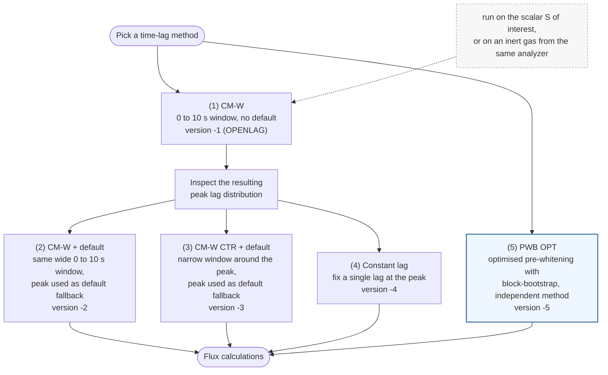

# Choosing a time-lag option

Five time-lag options are compared in this study (see
[processing versions](processing-versions.md) for the exact settings). Four of
them start from one exploratory run, **OPENLAG**, and use its peak lag
distribution to configure themselves; the fifth, **PWB$_{OPT}$**, is an
independent method. The flowchart shows how they relate, and the notes below say
when each is appropriate.

## When to use what

**1. OPENLAG (CM-W, wide window, no default).** The exploratory first pass. It
searches the whole 0 to 10 s window every half-hour with no fallback, so its
output reveals the lag distribution and its modal peak, which the next three
options are built on. Because nothing constrains the search, it is the most
exposed to the covariance-maximisation ("mirroring") bias for low
signal-to-noise gases like N₂O: per half-hour the lag that maximises the absolute
covariance is picked, which inflates the flux away from zero. The covariance can be
maximised against the scalar S of interest itself, or against another inert gas
measured by the same analyzer (which shares the sampling line, so its lag is easier
to detect); that lag is then applied to S. Use it to characterise the lag and to
configure options 2 to 4; treat its own flux as the upper bound of that bias, not
as the final answer.

**2. CM-W + default (wide window, default fallback).** Covariance maximisation
over the same wide window, but it falls back to the nominal lag (the OPENLAG
peak) whenever the search is unreliable. Use it when you want automatic
per-half-hour lags with a safety net against obviously wrong picks. It still
carries most of the mirroring bias, since the search range is unchanged.

**3. CM-W$^{CTR}$ + default (narrow window, default fallback).** The search is
constrained to a narrow window around the peak, with the same fallback.
Constraining the window is what curbs the mirroring bias while still letting the
lag track real variation within a known range. Use it when the true lag is well
constrained and reasonably stable. This is the recommended covariance-maximisation
option.

**4. Constant lag.** A single fixed lag, set at the OPENLAG peak, applied to every
half-hour. Use it when the lag is physically stable (for example a steady
closed-path setup) and you want to remove the covariance-maximisation bias
entirely. It gives the most conservative budget but ignores any real lag
variation over time.

**5. PWB$_{OPT}$ (optimised pre-whitening with block-bootstrap).** Independent of
covariance maximisation and robust to the mirroring bias. It is the reference
method (Vitale et al. 2024): use it as the benchmark that the covariance
maximisation options are judged against, and as the default choice when a
bias-resistant lag is wanted without tuning a window by hand.

## Rule of thumb

- Always run **OPENLAG** first: you need its peak distribution to set up 2, 3 and
  4, and its flux shows how large the covariance-maximisation bias is for your
  gas.
- For a covariance-maximisation flux, prefer the constrained **CM-W$^{CTR}$**
  over the wide-window variants: the narrow window is what limits the bias.
- Use the **constant lag** only where the lag is genuinely stable.
- Reach for **PWB$_{OPT}$** when you want a bias-resistant lag with no window to
  tune, or as the reference the other options are compared against.
